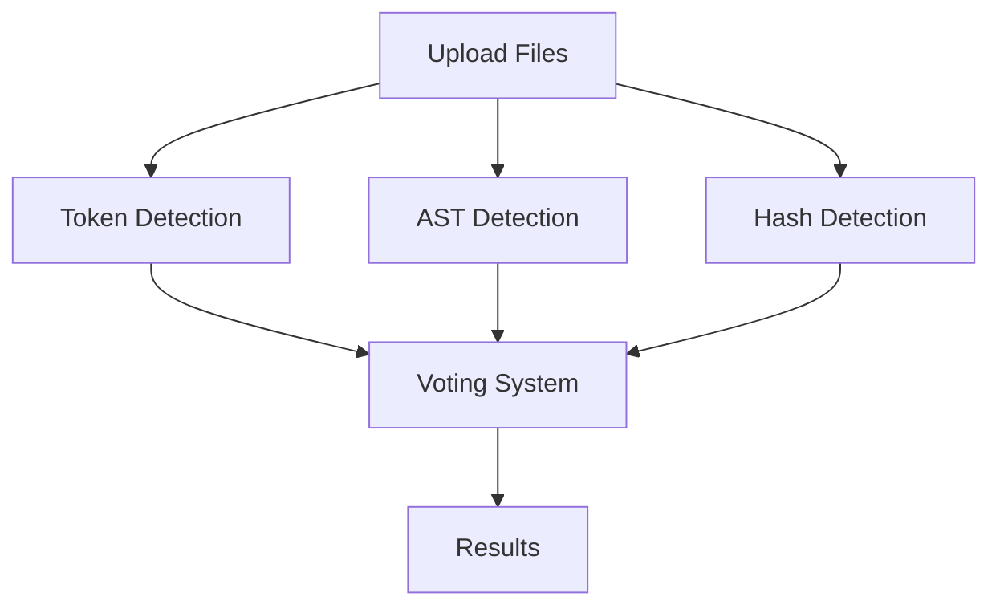

# Documentation

Comprehensive documentation for the CodeGuard plagiarism detection system.

## Structure

### `api/`
API documentation and endpoint specifications
- REST API endpoints
- Request/response formats
- Error codes and handling
- Example usage

### `algorithms/`
Detailed algorithm documentation
- Token-based detection methodology
- AST-based structural comparison
- Winnowing hash-based fingerprinting
- Voting system logic
- Performance characteristics

### `user-guide/`
End-user documentation
- Installation instructions
- Quick start guide
- Usage tutorials
- Troubleshooting tips
- FAQ

## Documentation Types

### 1. Technical Documentation (For Developers)
- Architecture overview
- Component specifications
- API references
- Database schema
- Configuration options
- Testing guidelines

### 2. Algorithm Documentation (For Researchers)
- Detection method descriptions
- Mathematical foundations
- Implementation details
- Parameter tuning
- Performance analysis
- References to academic papers

### 3. User Documentation (For Instructors)
- Installation guide
- Usage instructions
- Interpreting results
- Best practices
- Common scenarios
- Troubleshooting

## Quick Links

### Getting Started
- [Installation Guide](user-guide/installation.md)
- [Quick Start Tutorial](user-guide/quick-start.md)
- [First Analysis](user-guide/quick-start.md#your-first-analysis)

### API Documentation
- [Endpoints Overview](api/endpoints.md)
- [Request Examples](api/request-examples.md)
- [Error Handling](api/error-codes.md)

### Algorithm Details
- [Token Detection](algorithms/token-detection.md)
- [AST Detection](algorithms/ast-detection.md)
- [Winnowing Algorithm](algorithms/winnowing-algorithm.md)

### Troubleshooting
- [Common Issues](user-guide/troubleshooting.md)
- [FAQ](user-guide/faq.md)

## Documentation Standards

### Markdown Format
All documentation uses GitHub-flavored Markdown:
- Clear headings hierarchy
- Code blocks with syntax highlighting
- Tables for structured data
- Links for cross-references

### Code Examples
Include runnable code examples:

```python
from detectors.token_detector import TokenDetector

detector = TokenDetector()
similarity = detector.compare(source1, source2)
print(f"Similarity: {similarity:.2%}")
```

### Diagrams
Use ASCII art or Mermaid for diagrams:



## Contributing to Documentation

### Adding New Documentation

1. Place files in appropriate directory
2. Follow naming convention: lowercase-with-hyphens.md
3. Add entry to relevant README
4. Include examples and diagrams
5. Cross-reference related docs

### Documentation Checklist

- [ ] Clear, descriptive title
- [ ] Introduction paragraph
- [ ] Structured sections with headings
- [ ] Code examples that work
- [ ] Screenshots where helpful
- [ ] Links to related documentation
- [ ] Correct spelling and grammar

### Style Guide

- **Headings**: Use sentence case
- **Code**: Inline `code` or fenced blocks
- **Emphasis**: *Italic* for emphasis, **bold** for strong
- **Lists**: Ordered for steps, unordered for items
- **Links**: Descriptive text, not "click here"

## Version History

Document version history in each file:

```markdown
---
Version: 1.0
Last Updated: 2025-11-05
Author: CodeGuard Team
---
```

## Accessibility

- Use clear, simple language
- Define technical terms on first use
- Include alt text for images
- Structure content logically
- Test with screen readers

## Feedback

Documentation improvements welcome:
- Open issue on GitHub
- Suggest clarifications
- Report errors or outdated info
- Contribute examples

## Maintenance

Regular documentation updates:
- Quarterly review for accuracy
- Update with new features
- Fix broken links
- Incorporate user feedback
- Sync with code changes
